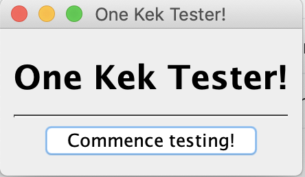
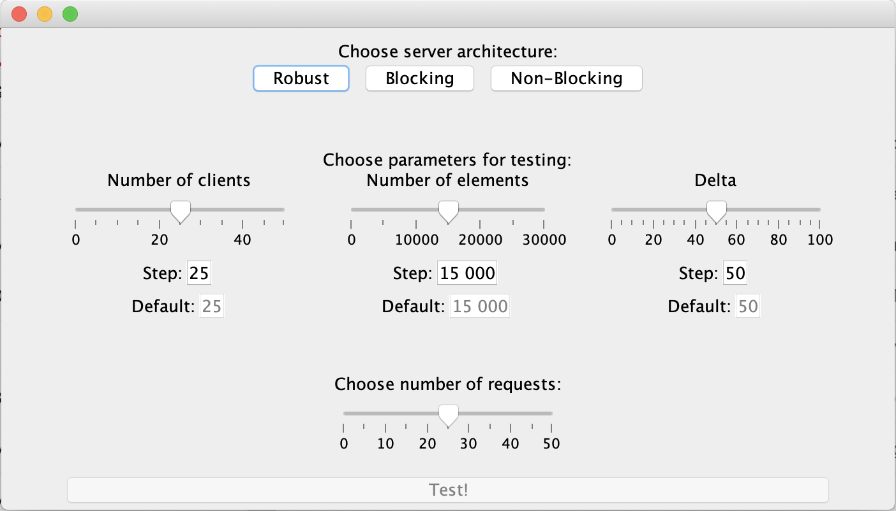
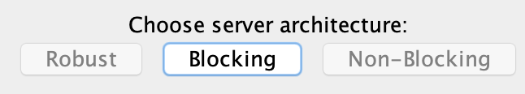
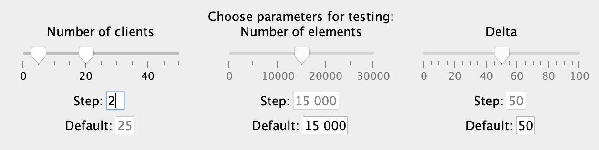
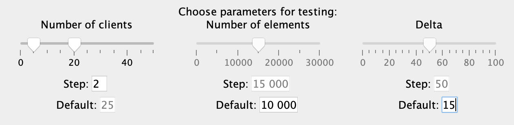
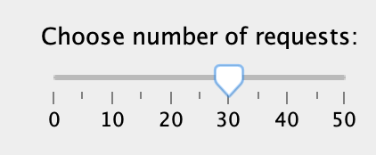
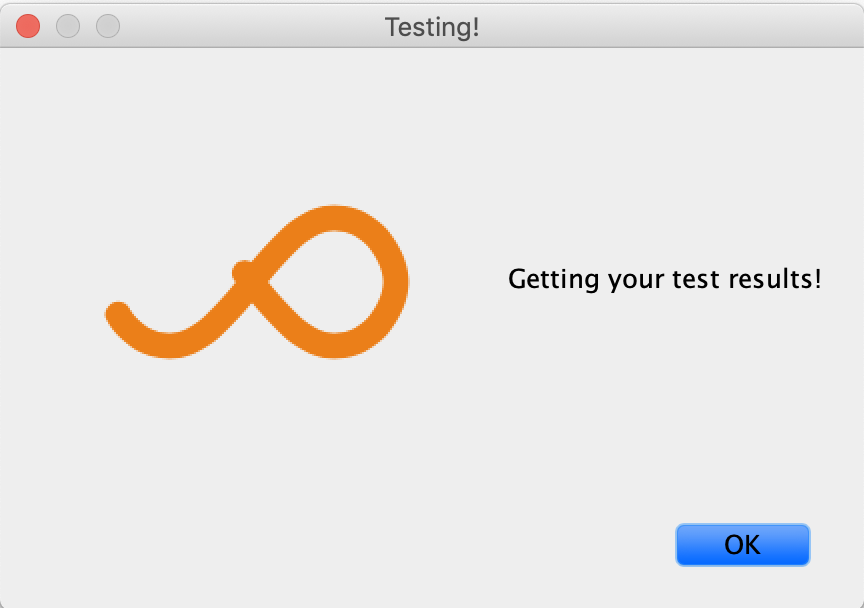
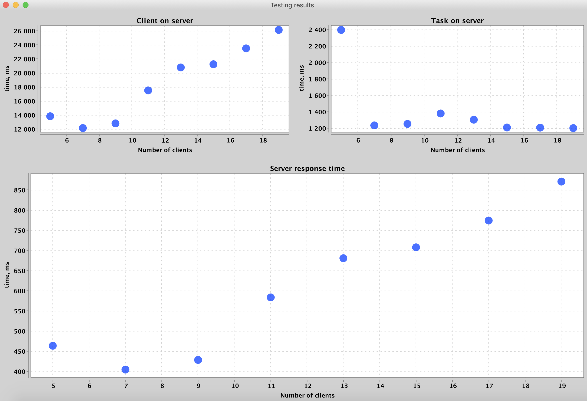

# Java One Kek

# Запуск

Запуск сервера производится командой
```
java -jar Server.jar
```

Запуск клиента производится командой
```
java -jar Client.jar
```

Кроме того, клиенту в качестве параметра командной строки можно передать 
адрес хоста, на котором развёрнут сервер (по умолчанию считается, что
сервер развёрнут на `localhost`):
```
java -jar Client.jar one-kek.vk.com
```

# Процесс работы с приложением

При запуске приложения пользователь видит приветсвенное сообщение,
уведомляющее его о том, что можно начать тестирование серверных
архитектур.



Пользователь жмёт на кнопку "Commence testing!" и переходит на экран
выбора параметров тестирования.



В верху экрана можно выбрать тип архитектуры сервера, которая будет
тестироваться:
* `Robust` — новый поток для каждого клиента.
* `Blocking` — принимаем сообщения от клиентов и отпарвляем им сообщения
в отдельных потоках, а задачи обрабатываем в ThreadPool'е.
* `Non-Blocking` — неблокирующая архитектура на Selector'ах.



После выбора архитектуры сервера нужно определиться с тем, какой параметр
будет меняться в ходе тестирования:
* `Number of clients` — число клиентов, отправляющих запросы.
* `Number of elements` — число элементов в сортируемых массивах.
* `Delta` — время между отправкой сообщений клиентами.

Выбрать промежуток, в котором будет меняться параметр, и шаг, с которым
он будет это делать, можно с помощью соответвующей параметру
шкалы и поля `Step`. 



После выбора промежутка для какого-то параметра возможность выбирать
промежутки для других параметров заблокируется. Для этих параметров
можно отредактировать значение поля `Default`, которое задаёт константное
значение параметра на протяжении всего тестирования.

**NB**: к сожалению, у меня не было
возможности прослушать курс по UI/UX, поэтому дизайнерские решения, которые
были приняты в рамках разработки интерфейса приложения, могут вызывать 
некоторые вопросы.



Осталось выбрать, какое количество сообщенйи будет отсылать 
каждый из клиентов на сервер.



Теперь пользователь должен нажать на кнопку `Test!`, чтобы начать
тестирование приложения. 

На протяжении всего процесса тестирования пользователя будет сопровождать
следующее окно, приятная анимация на котором тонко намекает, сколько времени
пользователю придётся ждать результатов тестирования:



Если нажать на кнопку `Ok`, то окно и приятная анимация пропадут.
Поэтому лучше на неё не нажимать.

Вне зависимости от этого решения пользователя, когда тестирование 
будет завершено, на экране появятся его результаты:
три графика, соответствующие изменению метрик тестирования в зависимости
от значения изменяемого параметра.

График `Client on server` показывает изменение времени обработки
клинта на сервере. График `Task on server` показывает изменение времени
обработки одной задачи сервером. График `Server response` показывает
изменение среднего времени ответа сервера клиенту на запрос.



Параллельно вместе с этим в директории, из которой запущено приложение,
появится (или перезапишется!) файл `testing_results.res`, содержащий
данные, по которым построены графики.

# Experiments

В папке `Experiments` содержатся 9 графиков, соответствующих
изменениям метрик тестирования в зависимости от того, какой из
трёх параметров изменялся в ходе тестирования.

Там же лежат данные, по которым были построены эти графики.